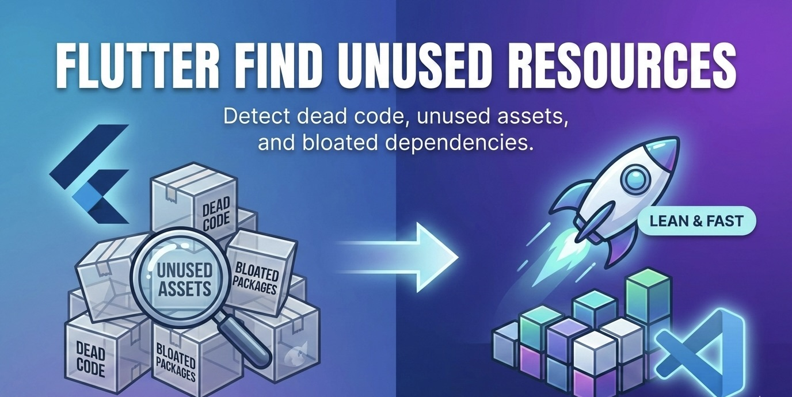
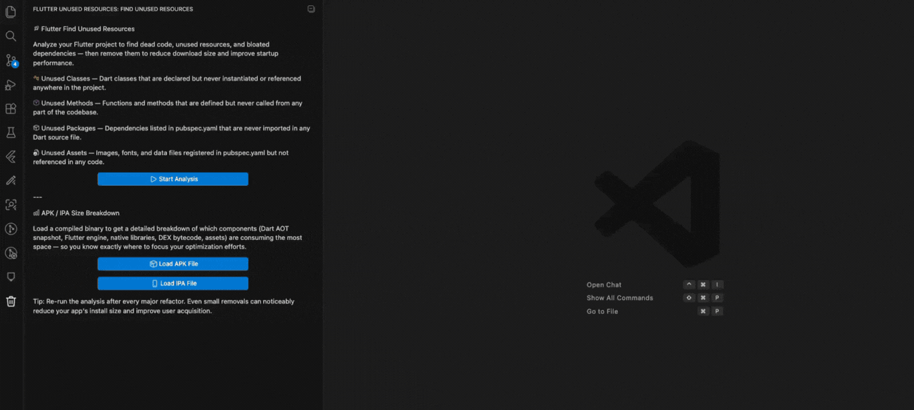
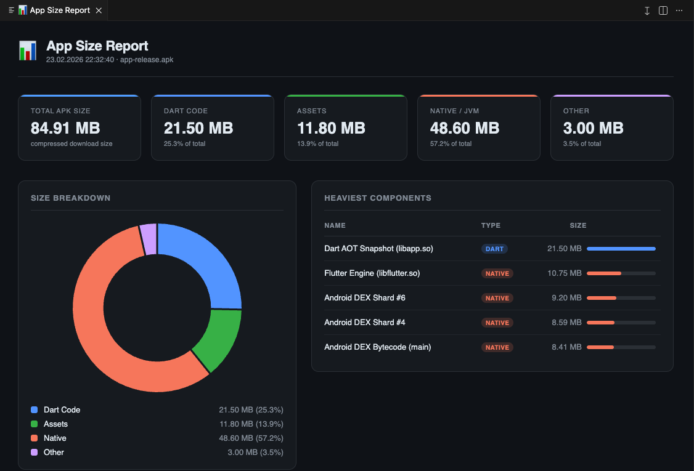

# 🚀 Flutter Find Unused Resources

<div align="center">

**Shrink your app. Ship faster. Stay clean.**

*The all-in-one VS Code extension for Flutter developers to eliminate dead code and analyze build size — without leaving your editor.*

[](https://marketplace.visualstudio.com/items?itemName=FurkanTopaloglu.flutter-find-unused-resources)
[](https://marketplace.visualstudio.com/items?itemName=FurkanTopaloglu.flutter-find-unused-resources)
[](https://marketplace.visualstudio.com/items?itemName=FurkanTopaloglu.flutter-find-unused-resources)
[](https://opensource.org/licenses/MIT)



### ⚡ See it in Action!


</div>

---

## ✨ Why Flutter Find Unused Resources?

Every Flutter project accumulates technical debt over time — forgotten assets, abandoned classes, deprecated methods, and unused packages quietly bloat your app's size and slow down your team. **Flutter Find Unused Resources** gives you X-ray vision into your codebase and your builds, so you can cut the fat and deliver a leaner, faster app to your users.

> ⚡ No more guessing. No more manual searches. Just clean, optimized Flutter code.

---

## 🎯 Features

### 🧹 Source Code Cleanup

Automatically detect dead code lurking in your Flutter project — all from a dedicated panel inside VS Code.

- 🔍 **Unused Classes** — Instantly find classes defined but never referenced anywhere in your project.
- 🔧 **Unused Methods** — Surface methods that are declared but never called.
- 📦 **Unused Packages** — Identify `pubspec.yaml` dependencies you're importing but not actually using.
- 🖼️ **Unused Assets** — Spot image, font, and file assets declared in `pubspec.yaml` that no code ever loads.
- 🖱️ **Click-to-Navigate** — Click any detected issue in the tree view to instantly jump to the exact file and line — no manual searching required.
- ⚡ **Powered by Dart CLI** — Analysis runs via a robust background Dart CLI tool, delivering accurate, project-wide results without slowing down your editor.


---

### 📊 Build Size Analysis

Stop wondering what's eating your app's megabytes. Analyze your existing **APK** or **IPA** file in seconds — no rebuild needed.

- 📂 **Zero Rebuild Required** — Point the extension at an already-built `.apk` or `.ipa` file and get instant insights.
- 🎯 **Smart File Picker** — The built-in file picker filters exclusively for `.apk` and `.ipa` extensions so you always load the right file.
- 🥧 **Animated Pie Chart** — A gorgeous, Chart.js-powered interactive pie chart breaks down your app's composition by category:
  - 🎨 Assets
  - ⚙️ Native Code
  - 🎯 Dart Code
  - ...and more
- 🏆 **Top 5 Heaviest Files** — A detailed table highlights the five largest contributors to your build size, so you know exactly where to focus your optimization efforts.
- 🖥️ **Beautiful Dashboard** — Results are presented in a sleek Webview Panel dashboard directly inside VS Code — no browser, no external tools.



---

## 🛠️ How to Use

### Source Code Cleanup

1. **Open your Flutter project** in VS Code.
2. **Click the Flutter Find Unused Resources icon** in the Activity Bar on the left sidebar.
3. **Click "Analyze Project"** to start the background Dart CLI scan.
4. Browse the results in the **TreeView panel**, organized by category (Classes, Methods, Packages, Assets).
5. **Click any item** in the list to open the file and jump directly to the relevant line.
6. Clean up with confidence! 🎉

### Build Size Analysis

1. **Build your Flutter app** first with `flutter build apk` or `flutter build ipa` (or use an existing build).
2. Click the **Flutter Find Unused Resources icon** in the Activity Bar.
3. Click **"Load APK File"** or **"Load IPA File"** depending on your target platform.
4. Select your build file using the file picker — only `.apk` / `.ipa` files will be shown.
5. The **Dashboard** will open automatically, displaying:
   - An animated pie chart of your app's size composition.
   - A table of the **Top 5 Heaviest Files** by size.
6. Use the insights to prioritize your optimization work! 📉

---

## 📋 Requirements

Before using this extension, make sure you have the following installed:

| Requirement | Version | Notes |
|---|---|---|
| **VS Code** | `^1.85.0` | Minimum supported version |
| **Flutter SDK** | `>=3.0.0` | Must be available in your `PATH` |
| **Dart SDK** | `>=3.0.0` | Bundled with Flutter SDK |

> 💡 **Tip:** Run `flutter doctor` in your terminal to verify your Flutter environment is set up correctly before using this extension.

---

## 🚀 Getting Started

Install the extension directly from the [VS Code Marketplace](https://marketplace.visualstudio.com/items?itemName=FurkanTopaloglu.flutter-find-unused-resources):

```bash
# Via VS Code Quick Open (Ctrl+P / Cmd+P)
ext install FurkanTopaloglu.flutter-find-unused-resources
```

Or search for **"Flutter Find Unused Resources"** in the Extensions panel (`Ctrl+Shift+X` / `Cmd+Shift+X`).

---

## 💬 Feedback & Issues

Found a bug? Have a feature request? We'd love to hear from you!

- 🐛 **Report a Bug** → [Open an Issue](https://github.com/FurkanTopaloglu/find-unused-resources/issues/new?template=bug_report.md)
- 💡 **Request a Feature** → [Start a Discussion](https://github.com/FurkanTopaloglu/find-unused-resources/discussions)
- ⭐ **Enjoying the extension?** Please consider leaving a [review on the Marketplace](https://marketplace.visualstudio.com/items?itemName=FurkanTopaloglu.flutter-find-unused-resources&ssr=false#review-details) — it helps other Flutter developers discover this tool!

---

## 🗺️ Roadmap

- [ ] Auto-fix support (one-click removal of unused assets and packages)
- [ ] Android App Bundle (`.aab`) analysis support
- [ ] Historical build size comparison (track size over time)
- [ ] CI/CD integration via CLI flags
- [ ] Severity levels and custom ignore rules

---

## 📄 License

This project is licensed under the **MIT License** — see the [LICENSE](LICENSE) file for details.

```
MIT License

Copyright (c) 2026 Flutter Find Unused Resources Contributors

Permission is hereby granted, free of charge, to any person obtaining a copy
of this software and associated documentation files (the "Software"), to deal
in the Software without restriction, including without limitation the rights
to use, copy, modify, merge, publish, distribute, sublicense, and/or sell
copies of the Software, and to permit persons to whom the Software is
furnished to do so, subject to the following conditions:

The above copyright notice and this permission notice shall be included in all
copies or substantial portions of the Software.

THE SOFTWARE IS PROVIDED "AS IS", WITHOUT WARRANTY OF ANY KIND, EXPRESS OR
IMPLIED, INCLUDING BUT NOT LIMITED TO THE WARRANTIES OF MERCHANTABILITY,
FITNESS FOR A PARTICULAR PURPOSE AND NONINFRINGEMENT.
```

---

<div align="center">

Made with ❤️ for the Flutter community

**[⬆ Back to Top](#-flutter-find-unused-resources)**

</div>
